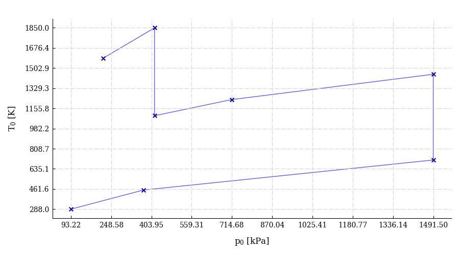
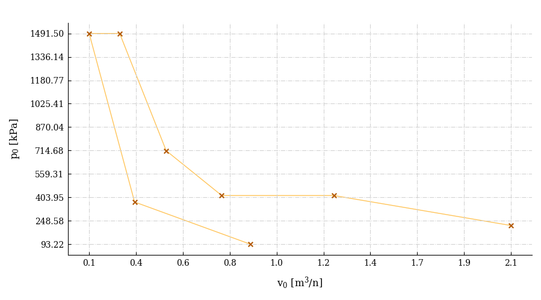
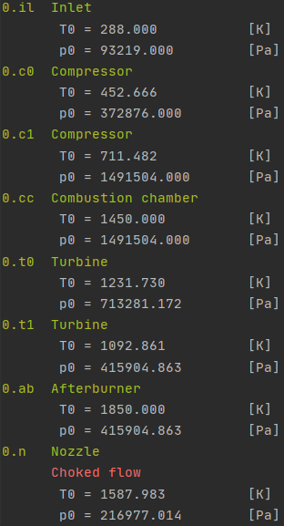

# Huracan

[The API reference is available here.](https://huracan-docs.github.io/)

:construction: **WARNING! Under active development**

## Install

    pip install huracan
    
## Example script

Simple turbojet engine with 2 compressors and 2 turbines in a 2 shaft configuration and no secondary airflows.

    from huracan.engine import shaft
    from huracan.thermo.fluids import gas, fuel
    from huracan.components import inlet, compressor, combustion_chamber, turbine, afterburner, nozzle
    
    
    mf = 160
    M = 0
    t = 288
    p = 101325
    
    fuel_cc = fuel(LHV=43e6)
    fuel_ab = fuel(LHV=43e6)
    
    g = gas(mf=mf,
            cp=lambda T: 1150 if T > 600 else 1000,
            k=lambda T: 1.33 if T > 600 else 1.4,
            m=M, t_0=t, p_0=p)
    
    i  = inlet(PI=0.92)
    c1 = compressor(eta=0.85, PI=4)
    c2 = compressor(eta=0.85, PI=4)
    cc = combustion_chamber(fuel_cc, eta=0.97, t01=1450)
    t1 = turbine(0.9)
    t2 = turbine(0.9)
    ab = afterburner(fuel_ab, eta=0.95, t01=1850)
    n  = nozzle(0.95)
    
    
    shaft1 = shaft(c1, t2, eta=0.99)
    shaft2 = shaft(c2, t1, eta=0.99)
    
    stream = g-i-c1-c2-cc-t1-t2-ab-n
    
    stream.run()
    
    # Plot p-v diagram
    stream.plot_p_v(show=True, color='orange')
    # Plot T-p diagram
    stream.plot_T_p(show=True, color='orange')

|  |
| --- |
|  |
|  |
