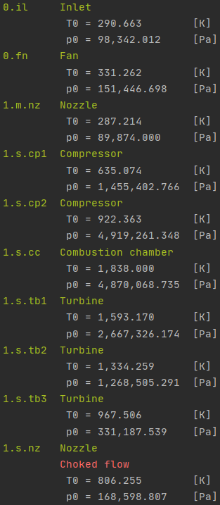

# Huracan

:construction: :construction: :construction:

__WARNING! Under active development__

:construction: :construction: :construction:

Huracan is an open source, 0-dimensional, object-oriented airbreathing engine 
modelling package for preliminary analysis and design of airbreathing engines, 
divulgation and educational purposes.

**Capabilities**
At the moment Huracan is capable of modelling engines with an arbitrary number of 
components connected by an arbitrary number of shafts. It allows for a single 
combustion chamber per stream and reheating. Multiple-stream systems can be modelled, 
as well as splitting (such as the bypass flow of a turbofan) and mixing streams (such 
as in the nozzle of a mixed exhaust turbofan).

**Inspiration**
The inspiration for the project lies in traditional thermodynamic plant diagrams, 
and similar architectures are used in well known proprietary tools such as 
[GasTurb](https://www.gasturb.de/) and [NLR's GSP](https://www.gspteam.com/index.html).

**Documentation**
[The API reference is available here.](https://huracan-docs.github.io/)

`Antonio Lopez Rivera, 2021`

## Install

    pip install huracan

## Examples

### [Single spool turboprop engine.](https://github.com/alopezrivera/huracan/blob/master/examples/turboprop/turboprop_1s-1s.py)

  

|  |
| --- |
|  |

### [Twin-spool, reheated turbojet engine with an electrical power plant.](https://github.com/alopezrivera/huracan/blob/master/examples/turbojet/turbojet_1s-2s.py)

  

|  |
| --- |
|  |

### [Three-spool, separated exhaust turbofan engine.](https://github.com/alopezrivera/huracan/blob/master/examples/turbofan/turbofan_3s-2s.py)

  

|  |
| --- |
|  |

---
[Back to top](#huracan)
