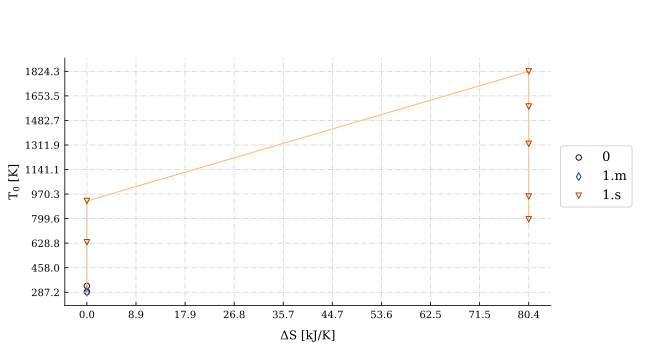
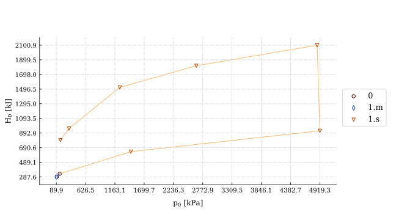
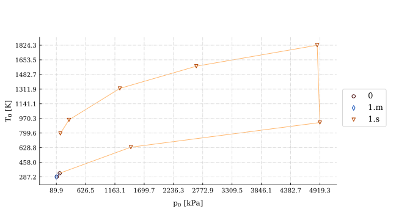

# Huracan

Huracan is an open source, 0-dimensional, object-oriented airbreathing engine 
modelling package for preliminary analysis and design of airbreathing engines, 
divulgation and educational purposes.

At the moment Huracan is capable of modelling engines with an arbitrary number of 
components connected by an arbitrary number of shafts. It allows for a single 
combustion chamber per stream, reheating, intercooling and the addition of electrical
system power requirements. Multiple-stream systems can be modelled, 
as well as splitting (such as the bypass flow of a turbofan) and mixing streams (such 
as in the nozzle of a mixed exhaust turbofan).

The inspiration for the project lies in traditional thermodynamic plant diagrams, 
and similar architectures are used in well known proprietary tools such as 
[GasTurb](https://www.gasturb.de/) and [NLR's GSP](https://www.gspteam.com/index.html).

[The API reference is available here.](https://huracan-docs.github.io/)

## Install

    pip install huracan

## Examples

### [Single spool turboprop engine.](https://github.com/alopezrivera/huracan/blob/master/examples/engines/turboprop/turboprop_1s-1s.py)

| 

 | 

 |
| --- | --- |

|  |  |
| --- | --- |
|  |  |

### [Twin-spool, reheated turbojet engine with an electrical power plant.](https://github.com/alopezrivera/huracan/blob/master/examples/engines/turbojet/turbojet_1s-2s-ab.py)

| 

 | 

 |
| --- | --- |

|  |  |
| --- | --- |
|  |  |

### [Three-spool, separated exhaust turbofan engine.](https://github.com/alopezrivera/huracan/blob/master/examples/engines/turbofan/turbofan_2s-3s.py)

| 

 | 

 |
| --- | --- |

|  |  |
| --- | --- |
|  |  |

---
[Back to top](#huracan)
